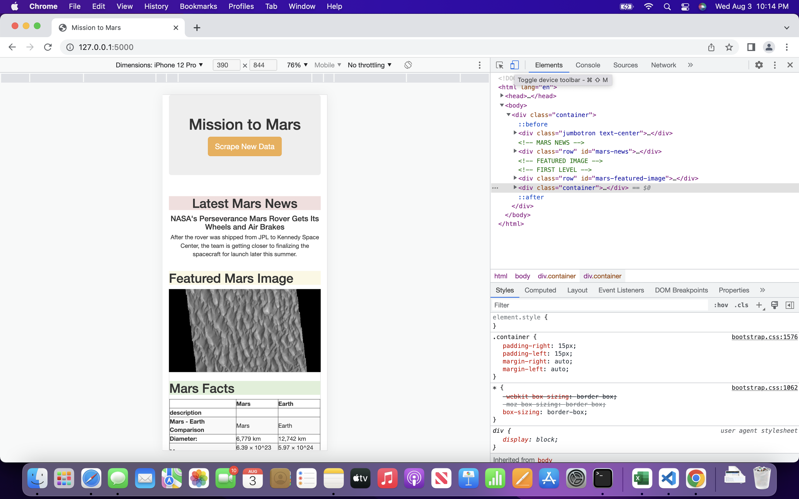
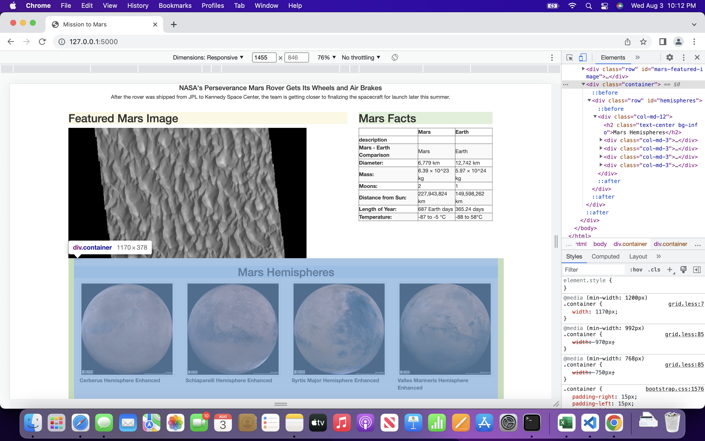
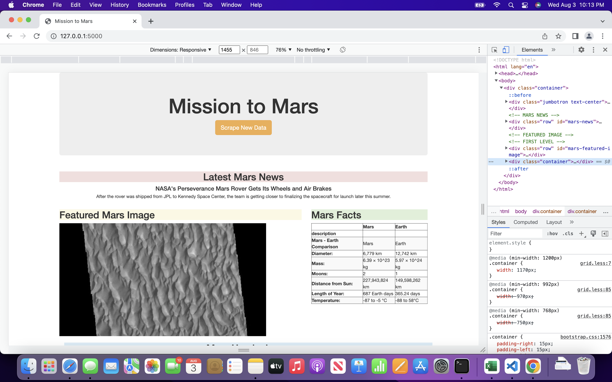

# Mission to Mars
# Overview and Results

In this challenge we utilize data scraping methods to compile information to be presented in a flask app. Data was taken from several mars websites; https://redplanetscience.com,  https://spaceimages-mars.com, https://galaxyfacts-mars.com, and https://astrogeology.usgs.gov. 

## Scraping the Data

From these sites I was able to retrieve a news headline and text posted on https://redplanetscience.com, a featured image of mars posted on https://spaceimages-mars.com, a table of facts about mars and earth from https://galaxyfacts-mars.com, and four images of mars hemispheres with titles from https://astrogeology.usgs.gov. The functions used to scrape the data was saved in a python file titled scraping.py, which is referenced in a flask app, which can be found in the file app.py. 

## Customizing the Web App Using Bootstrap

### Web App Responsiveness
In the final portion of this challenge I was able to customize the flask app. Firstly, I edited the index.html file to ensure that each element would be responsive to different screen sizes. The result of this was tested by opening the web app, clicking ‘toggle device toolbar’ and viewing the app using different	screen dimensions. For example, the if the web app was accessed on an iPhone 12 Pro it would appear like the image mars_responsiveness.png.

### Stylistic Customizations 
Next, I was able to format the four hemisphere images so they appear as thumbnails, all in one row on the web page. This can be seen in the image mars_hemispheres.png. 

Lastly, I customized the ‘Scrape New Data’ button, making it orange. I also edited the facts table, giving it a striped affect, and I added colored backgrounds to each of the headers. The results of these customizations can be seen in the image mars_customization.png.

